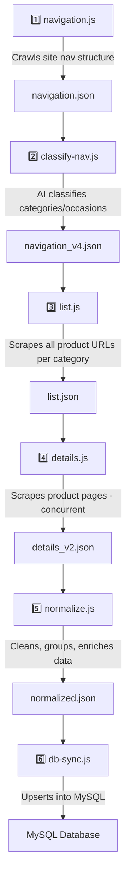
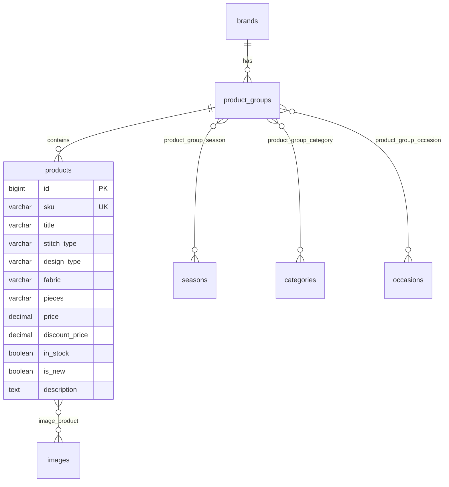

# 🧵 Suit Dekho — Complete Project Overview

## What Is This Project?

**Suit Dekho** is a **web scraping & data pipeline** for Pakistani women's fashion brands. It scrapes product data from brand websites (using Playwright), normalizes it, classifies it using AI, and syncs it into a MySQL database.

> [!IMPORTANT]
> This is **NOT a web app** with a `dev` server. It's a collection of **Node.js scraping scripts** that run individually. There is no `npm run dev` — that's why the command failed.

---

## Brands Covered

| Brand | Scripts | Status |
|-------|---------|--------|
| **Khaadi** | 7 scripts (full pipeline) | ✅ Mature — has navigation, listing, details, normalize, classify, db-sync |
| **Maria B** | 5 scripts | ✅ Good — has listing, details, normalize, classify, db-sync |
| **Sapphire** | 2 scripts | 🟡 Early — only has listing and details |

---

## Tech Stack

| Component | Technology |
|-----------|------------|
| Scraping Engine | **Playwright** (Chromium) |
| Data Processing | **Node.js** (vanilla) |
| AI Classification | **Groq API** (LLaMA 3.1 8B via OpenAI-compatible client) |
| Database | **MySQL** (via `mysql2`) |
| HTML Parsing | **jsdom**, **he** (HTML entity decoding) |
| Color Validation | **validate-color** |

---

## Pipeline Flow (Per Brand)



---

## Detailed Script Breakdown

### Khaadi Pipeline ([khaadi/scripts/](file:///c:/Users/USMAN/Desktop/Projects/suit_dekho/khaadi/scripts))

| # | Script | Purpose | Input → Output |
|---|--------|---------|----------------|
| 1 | [navigation.js](file:///c:/Users/USMAN/Desktop/Projects/suit_dekho/khaadi/scripts/navigation.js) | Crawls Khaadi.com navigation links recursively | Manual → `navigation_v2.json` → `navigation_v3.json` |
| 2 | [classify-nav.js](file:///c:/Users/USMAN/Desktop/Projects/suit_dekho/khaadi/scripts/classify-nav.js) | Classifies nav nodes into categories/occasions (deterministic rules + Groq AI fallback) | `navigation_v3.json` → `navigation_v4.json` |
| 3 | [list.js](file:///c:/Users/USMAN/Desktop/Projects/suit_dekho/khaadi/scripts/list.js) | Loads each category page & extracts all product URLs | `navigation_v4.json` → `list.json` |
| 4 | [details.js](file:///c:/Users/USMAN/Desktop/Projects/suit_dekho/khaadi/scripts/details.js) | Visits each product page (4 concurrent tabs), extracts title, SKU, price, images, description, related products | `list.json` → `details_v2.json` |
| 5 | [normalize.js](file:///c:/Users/USMAN/Desktop/Projects/suit_dekho/khaadi/scripts/normalize.js) | Groups products by SKU, deduplicates, extracts stitch type/pieces/fabric, assigns seasons | `details_v2.json` → `normalized.json` |
| 6 | [db-sync.js](file:///c:/Users/USMAN/Desktop/Projects/suit_dekho/khaadi/scripts/db-sync.js) | Upserts normalized data into MySQL with full relation sync (seasons, categories, occasions, images) | `normalized.json` → MySQL |
| 7 | [server_test_script.js](file:///c:/Users/USMAN/Desktop/Projects/suit_dekho/khaadi/scripts/server_test_script.js) | Variant of details scraper with NordVPN extension support (for scraping from servers) | `list.json` → `details.json` |

### Maria B Pipeline ([maria_b/scripts/](file:///c:/Users/USMAN/Desktop/Projects/suit_dekho/maria_b/scripts))

| # | Script | Purpose |
|---|--------|---------|
| 1 | [list.js](file:///c:/Users/USMAN/Desktop/Projects/suit_dekho/maria_b/scripts/list.js) | Scrapes Maria B product listings (handles Shopify infinite scroll pagination) |
| 2 | [details.js](file:///c:/Users/USMAN/Desktop/Projects/suit_dekho/maria_b/scripts/details.js) | Scrapes individual product details |
| 3 | [normalize.js](file:///c:/Users/USMAN/Desktop/Projects/suit_dekho/maria_b/scripts/normalize.js) | Normalizes scraped data |
| 4 | [classify-nav.js](file:///c:/Users/USMAN/Desktop/Projects/suit_dekho/maria_b/scripts/classify-nav.js) | AI-based nav classification |
| 5 | [db-sync.js](file:///c:/Users/USMAN/Desktop/Projects/suit_dekho/maria_b/scripts/db-sync.js) | MySQL database sync |

### Sapphire Pipeline ([sapphire/scripts/](file:///c:/Users/USMAN/Desktop/Projects/suit_dekho/sapphire/scripts))

| # | Script | Purpose |
|---|--------|---------|
| 1 | [list.js](file:///c:/Users/USMAN/Desktop/Projects/suit_dekho/sapphire/scripts/list.js) | Scrapes Sapphire product listings |
| 2 | [details.js](file:///c:/Users/USMAN/Desktop/Projects/suit_dekho/sapphire/scripts/details.js) | Scrapes individual product details |

---

## Database Schema ([migrations.sql](file:///c:/Users/USMAN/Desktop/Projects/suit_dekho/migrations.sql))



Key features:
- **Soft deletes** (`deleted_at`) for products no longer on the website
- **Product groups** link related products (e.g., 2-piece + 3-piece of same design)
- **Many-to-many** relations for images, seasons, categories, and occasions

---

## Key Design Patterns

1. **Resume-safe scraping**: Every script saves progress after each category/product — if it crashes, it resumes where it left off
2. **SKU deduplication**: Global SKU map prevents re-scraping the same product across categories
3. **Concurrent scraping**: Details scripts use 2-4 parallel browser tabs for speed
4. **Resource blocking**: Images, fonts, stylesheets are blocked during scraping for performance
5. **Hybrid classification**: Deterministic rules first, AI (Groq) only for ambiguous navigation nodes

---

## How to Run Individual Scripts

Each script runs independently from the **project root**:

```bash
# Example: Khaadi product listing scraper
node khaadi/scripts/list.js

# Example: Khaadi details scraper
node khaadi/scripts/details.js

# Example: Khaadi normalize (no browser needed)
node khaadi/scripts/normalize.js

# Example: Khaadi DB sync (needs MySQL running)
node khaadi/scripts/db-sync.js
```

> [!WARNING]
> - Scraping scripts (`list.js`, `details.js`) launch a **real Chromium browser** — they need a display
> - `db-sync.js` requires a running **MySQL** server with the `suit_dekho` database created
> - `classify-nav.js` requires a valid **Groq API key**
> - `server_test_script.js` requires a **NordVPN browser extension** installed

---

## Existing Output Data

| Brand | File | Size |
|-------|------|------|
| Khaadi | `details_v2.json` | **31 MB** (full product details) |
| Khaadi | `normalized.json` | **4.4 MB** |
| Khaadi | `list.json` | **1.5 MB** |
| Maria B | `details.json` | **3.2 MB** |
| Maria B | `normalized.json` | **1.5 MB** |
| Sapphire | `details.json` | **90 KB** (early stage) |
